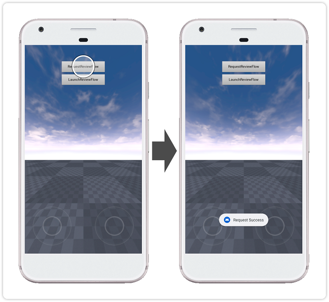
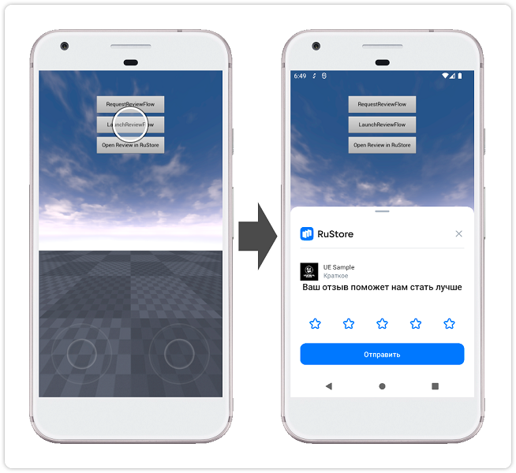

<!-- ── Language switch (EN active) ──────────────────────────────────── -->

  
    [RU][ru]
  
    EN
  

<!-- ────────────────────────────────────────────────────────────────── -->

## RuStore Unreal Engine plugin for reviews and ratings

### [🔗 Developer documentation][10]

- [SDK operating conditions](#SDK-operating-conditions)
- [Preparing required parameters](#Preparing-required-parameters)
- [Setting up the sample application](#Setting-up-the-sample-application)
- [Usage scenario](#Usage-scenario)
- [Distribution conditions](#Distribution-conditions)
- [Technical support](#Technical-support)

### SDK operating conditions

To use the reviews and ratings SDK, the following conditions must be met:

1. Android OS version 7.0 or higher.

2. The RuStore app is installed on the user's device.

3. The RuStore version on the user's device is up to date.

4. The user is logged into RuStore.

5. The app must be published in RuStore.

### Preparing required parameters

1. `applicationId` - a unique identifier of the app in the Android system in reverse domain name format (example: ru.rustore.sdk.example).

2. `*.keystore` - a key file used for [signing and authenticating an Android app](https://www.rustore.ru/help/en/developers/publishing-and-verifying-apps/app-publication/apk-signature/).

### Setting up the sample application

1. In project settings (Edit → Project Settings → Platforms → Android), specify the `applicationId` in the "Android Package Name" field — the app code from the RuStore developer console.

2. In project settings (Edit → Project Settings → Platforms → Android), under "Distribution Signing", specify the location and parameters of the previously prepared `*.keystore` file.

### Usage scenario

#### Preparing to launch the app review

Tapping the `RequestReviewFlow` button initiates the [process of preparing for launching the app review][20].

#### Launching the app review

Tapping the `LaunchReviewFlow` button initiates the [process of launching the app review][30].

### Distribution conditions

This software, including source codes, binary libraries, and other files, is distributed under the MIT license. Licensing information is available in the [MIT-LICENSE](../MIT-LICENSE.txt) document.

### Technical support

Additional help and instructions are available on the page [rustore.ru/help/](https://www.rustore.ru/help/en/) and by email at [support@rustore.ru](mailto:support@rustore.ru).

[10]: https://www.rustore.ru/help/en/sdk/reviews-ratings/unreal/10-5-1
[20]: https://www.rustore.ru/help/en/sdk/reviews-ratings/unreal/10-5-1#prestart
[30]: https://www.rustore.ru/help/en/sdk/reviews-ratings/unreal/10-5-1#start

[ru]: README.md
[en]: README.en.md
