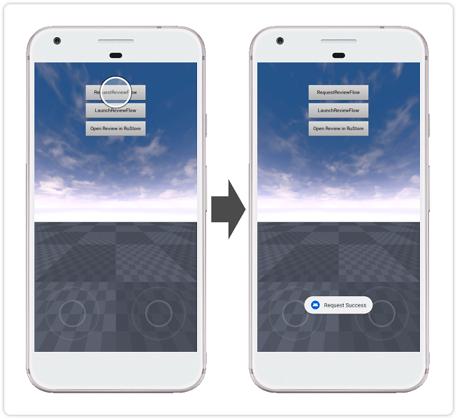
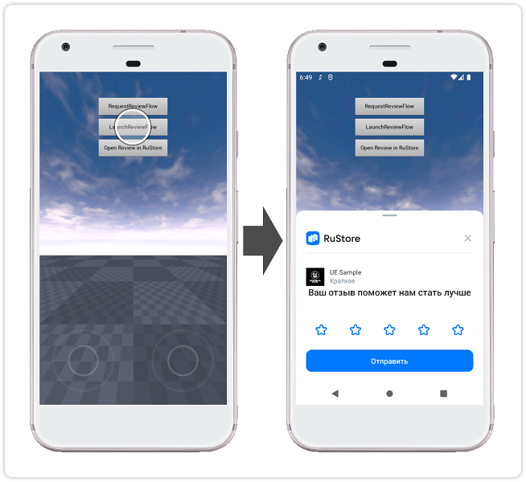

## RuStore Unreal Engine плагин для оценок и отзывов

### [🔗 Документация разработчика][10]

- [Условия работы SDK](#Условия-работы-SDK)
- [Подготовка требуемых параметров](#Подготовка-требуемых-параметров)
- [Настройка примера приложения](#Настройка-примера-приложения)
- [Сценарий использования](#Сценарий-использования)
- [Условия распространения](#Условия-распространения)
- [Техническая поддержка](#Техническая-поддержка)

### Условия работы SDK

Для работы SDK оценок и отзывов необходимо соблюдение следующих условий:

1. ОС Android версии 7.0 или выше.

2. На устройстве пользователя установлено приложение RuStore.

3. Версия RuStore на устройстве пользователя актуальная.

4. Пользователь авторизован в RuStore.

5. Приложение должно быть опубликовано в RuStore.

### Подготовка требуемых параметров

1. `applicationId` - уникальный идентификатор приложения в системе Android в формате обратного доменного имени (пример: ru.rustore.sdk.example).

2. `*.keystore` - файл ключа, который используется для [подписи и аутентификации Android приложения](https://www.rustore.ru/help/developers/publishing-and-verifying-apps/app-publication/apk-signature/).

### Настройка примера приложения

1. В настройках проекта (Edit → Project Settings → Platforms → Android) в поле “Android Package Name” укажите applicationId - код приложения из консоли разработчика RuStore.

2. В настройках проекта (Edit → Project Settings → Platforms → Android) в разделе “Distribution Signing” укажите расположение и параметры ранее подготовленного файла *.keystore.

### Сценарий использования

#### Подготовка к запуску оценки приложения

Тап по кнопке `RequestReviewFlow` выполняет процедуру [подготовки к запуску оценки приложения][20].

#### Запуск оценки приложения

Тап по кнопке `LaunchReviewFlow` выполняет процедуру [запуска оценки приложения][30].

### Условия распространения

Данное программное обеспечение, включая исходные коды, бинарные библиотеки и другие файлы распространяется под лицензией MIT. Информация о лицензировании доступна в документе [MIT-LICENSE](../MIT-LICENSE.txt).

### Техническая поддержка

Дополнительная помощь и инструкции доступны на странице [rustore.ru/help/](https://www.rustore.ru/help/) и по электронной почте [support@rustore.ru](mailto:support@rustore.ru).

[10]: https://www.rustore.ru/help/sdk/reviews-ratings/unreal/7-0-0
[20]: https://www.rustore.ru/help/sdk/reviews-ratings/unreal/7-0-0#prestart
[30]: https://www.rustore.ru/help/sdk/reviews-ratings/unreal/7-0-0#start
